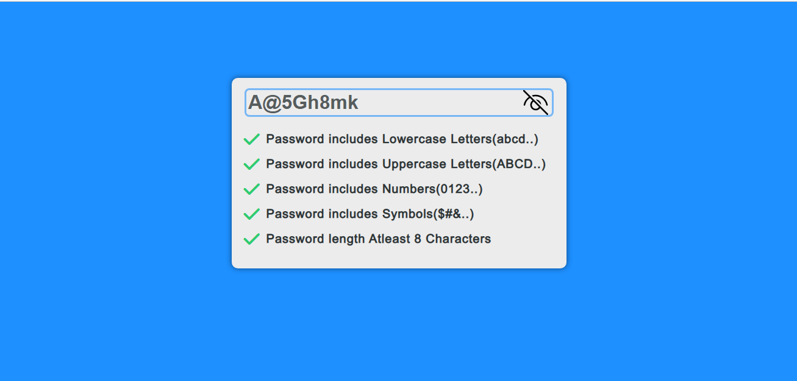

# Password Validator
This is a simple password validator that checks if a password meets certain requirements. It checks for the following:

1. Password length of at least 8 characters.
2. At least one lowercase letter
3. At least one uppercase letter
4. At least one number
5. At least one special character

* ### Technologies Used
1. HTML
2. CSS
3. JavaScript

* ### How to Use
1. Enter a password in the input field provided.
2. The password requirements will be displayed below the input field.
3. The requirements that are met will have a green check mark, while the requirements that are not met will have a red x-mark.

* ### Screenshots

* ### How to Contribute
If you want to contribute to this project, please follow these steps:

1. Fork this repository.
2. Create a new branch (git checkout -b new-feature).
3. Add your changes and commit them (git commit -m "add feature").
4. Push to the branch (git push origin new-feature).
5. Create a pull request.

* ### Credits
Font Awesome [Got to Site](https://fontawesome.com/) - for the check mark and x-mark icons.

